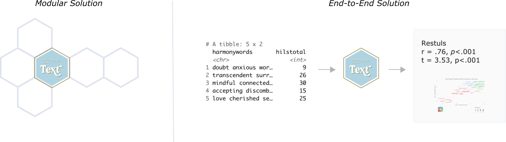

<!-- README.md is generated from README.Rmd. Please edit that file -->

```{r, include = FALSE}
knitr::opts_chunk$set(
  collapse = TRUE,
  comment = "#>",
  fig.path = "man/figures/README-",
  out.width = "100%"
)
```


# text 

<!-- badges: start -->
[](https://codecov.io/gh/oscarkjell/text)
[](https://CRAN.R-project.org/package=text)
[](https://github.com/oscarkjell/text/actions)
[](https://www.repostatus.org/#active)
[](https://www.tidyverse.org/lifecycle/#maturing)
[](https://CRAN.R-project.org/package=text)

<!-- badges: end -->

The language that individuals use contains a wealth of psychological information interesting for research. The *text*-package has two main objectives:

* First, to serve R-users as a *point solution* for transforming text to state-of-the-art word embeddings that are ready to be used for downstream tasks. 

* Second, to serve as an *end-to-end solution* that provides state-of-the-art AI techniques tailored for social and behavioral scientists.  

{width=75%}

*Text* is created through a collaboration between psychology and computer science to address research needs and ensure state-of-the-art techniques. It provides powerful functions tailored to test research hypotheses in social and behavior sciences for both relatively small and large datasets. *Text* is continuously tested on Ubuntu, Mac OS and Windows using the latest stable R version.


### Short installation guide
Most users simply need to run below installation code. 
For those experiencing problems, please see the [Extended Installation Guide](https://www.r-text.org/articles/Extended%20Installation%20Guide.html).

[CRAN](https://CRAN.R-project.org/package=text) version:

``` r
install.packages("text")
```

[GitHub](https://github.com/) development version:

``` r
# install.packages("devtools")
devtools::install_github("oscarkjell/text")
```

### Point solution for transforming text to embeddings
Recent significant advances in NLP research have resulted in improved representations of human language (i.e., language models). These language models have produced big performance gains in tasks related to understanding human language. Text are making these SOTA models  easily accessible through an interface to [HuggingFace](https://huggingface.co/transformers/) in Python.

```{r short_word_embedding_example, eval = FALSE, warning=FALSE, message=FALSE}
library(text)
# Transform the text data to BERT word embeddings
wordembeddings <- textEmbed(Language_based_assessment_data_8, 
                            model = 'bert-base-uncased')
```

*Text* provides many of the contemporary state-of-the-art language models that are based on deep learning to model word order and context. Multilingual language models can also represent several languages; multilingual BERT comprises *104 different languages*. 

*Table 1. Some of the available language models*
``` {r HuggingFface_tabble_short, echo=FALSE, results='asis'}
library(magrittr)

Models <- c("'bert-base-uncased'",
            "'roberta-base'",
            "'distilbert-base-cased'",
            "'bert-base-multilingual-cased'",
            "'xlm-roberta-large'"
            )

References <- c("[Devlin et al. 2019](https://www.aclweb.org/anthology/N19-1423/)",
                "[Liu et al. 2019](https://arxiv.org/abs/1907.11692)",
                "[Sahn et al., 2019](https://arxiv.org/abs/1910.01108)",
                "[Devlin et al. 2019](https://www.aclweb.org/anthology/N19-1423/)",
                "[Liu et al](https://arxiv.org/pdf/1907.11692.pdf)"
                )

Layers <- c("12",
            "12", 
            "6",
            "12",
            "24")

Language <- c("English",
              "English", 
              "English",
              "[104 top languages at Wikipedia](https://meta.wikimedia.org/wiki/List_of_Wikipedias)",
              "[100 language](https://huggingface.co/transformers/multilingual.html)")

Dimensions <- c("768", 
                "768", 
                "768", 
                "768", 
                "1024")

Tables_short <- tibble::tibble(Models, References, Layers, Dimensions, Language)

knitr::kable(Tables_short, caption="", bootstrap_options = c("hover"), full_width = T)
```
  
See [HuggingFace](https://huggingface.co/transformers/pretrained_models.html) for a more comprehensive list of models. 

### An end-to-end package
*Text* also provides functions to analyse the word embeddings with well-tested machine learning algorithms and statistics. The focus is to analyze and visualize text, and their relation to other text or numerical variables. An example is functions plotting statistically significant words in the word embedding space.  

```{r DPP_plot, message=FALSE, warning=FALSE}
library(text) 
# Use data (DP_projections_HILS_SWLS_100) that have been pre-processed with the textProjectionData function; the preprocessed test-data included in the package is called: DP_projections_HILS_SWLS_100
plot_projection <- textProjectionPlot(
  word_data = DP_projections_HILS_SWLS_100,
  y_axes = TRUE,
  title_top = " Supervised Bicentroid Projection of Harmony in life words",
  x_axes_label = "Low vs. High HILS score",
  y_axes_label = "Low vs. High SWLS score",
  position_jitter_hight = 0.5,
  position_jitter_width = 0.8
)
plot_projection

```


