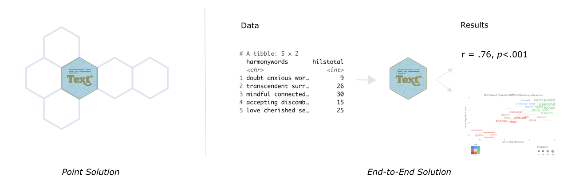

<!-- README.md is generated from README.Rmd. Please edit that file -->

# text 

<!-- badges: start -->

[](https://www.tidyverse.org/lifecycle/#maturing)
<!-- [](https://cran.r-project.org/package=pkgdown) -->
<!-- [](https://codecov.io/gh/r-lib/pkgdown?branch=master)-->
<!--[](https://github.com/oscarkjell/text/actions)-->
[](https://travis-ci.com/github/OscarKjell/text)
[](https://codecov.io/gh/oscarkjell/text)
<!-- badges: end -->

The language that individuals use contains a wealth of psychological
information interesting for research. The *text*-package has two main
objectives:

  - First, to serve R-users as a *point solution* for transforming text
    to state-of-the-art word embeddings that are ready to be used for
    downstream tasks.

  - Second, to serve as an *end-to-end solution* that provides
    state-of-the-art AI techniques tailored for social and behavioral
    scientists.



*Text* is created through a collaboration between psychology and
computer science to address research needs and ensure state-of-the-art
techniques. It provides powerful functions tailored to test research
hypotheses in social and behavior sciences for both relatively small and
large datasets.

### Short installation guide

Most users simply need to run below installation code. For those
experiencing problems, please see the [Extended Installation
Guide](https://www.r-text.org/articles/Extended%20Installation%20Guide.html).

[CRAN](https://CRAN.R-project.org) version:

``` r
install.packages("text")
```

[GitHub](https://github.com/) development version:

``` r
# install.packages("devtools")
devtools::install_github("oscarkjell/text")
```

### Point solution for transforming text to embeddings

Recent significant advances in NLP research have resulted in improved
representations of human language (i.e., language models). These
language models have produced big performance gains in tasks related to
understanding human language. Text are making these SOTA models easily
accessible through an interface to
[HuggingFace](https://huggingface.co/transformers/) in Python.

``` r
library(text)
# Transform the text data to BERT word embeddings
wordembeddings <- textEmbed(Language_based_assessment_data_8_10, 
                            model = 'bert-base-uncased')
```

*Text* provides many of the contemporary state-of-the-art language
models that are based on deep learning to model word order and context.
Multilingual language models can also represent several languages;
multilingual BERT comprises *104 different languages*.

*Table 1. Some of the available language models*

| Models                         | References                                              | Layers | Dimensions | Language                                                                             |
| :----------------------------- | :------------------------------------------------------ | :----- | :--------- | :----------------------------------------------------------------------------------- |
| ‘bert-base-uncased’            | [Devline et al. 2018](https://arxiv.org/abs/1810.04805) | 12     | 768        | English                                                                              |
| ‘roberta-base’                 | [Liu et al. 2019](https://arxiv.org/abs/1907.11692)     | 12     | 768        | English                                                                              |
| ‘distilbert-base-cased’        | [Sahn et al., 2019](https://arxiv.org/abs/1910.01108)   | 6?     | 768?       | English                                                                              |
| ‘bert-base-multilingual-cased’ | [Devline et al.2018](https://arxiv.org/abs/1810.04805)  | 12     | 768        | [104 top languages at Wikipedia](https://meta.wikimedia.org/wiki/List_of_Wikipedias) |
| ‘xlm-roberta-large’            | [Liu et al](https://arxiv.org/pdf/1907.11692.pdf)       | 24     | 1024       | [100 language](https://huggingface.co/transformers/multilingual.html)                |

See [HuggingFace’s Github](https://github.com/huggingface/transformers)
for a more comprehensive list of models.

### An end-to-end package

*Text* also provides functions to analyse the word embeddings with
well-tested machine learning algorithms and statistics. The focus is to
analyze and visualize text, and their relation to other text or
numerical variables. An example is functions plotting statistically
significant words in the word embedding space.

``` r
library(text)
# Use data (DP_projections_HILS_SWLS_100) that have been pre-processed with the textProjectionData function; the preprocessed test-data included in the package is called: DP_projections_HILS_SWLS_100
plot_projection <- textProjectionPlot(
  word_data = DP_projections_HILS_SWLS_100,
  x_axes = TRUE,
  y_axes = TRUE,
  title_top = " Dot Product Projection (DPP) of Harmony in life words",
  x_axes_label = "Low vs. High HILS score",
  y_axes_label = "Low vs. High SWLS score",
  position_jitter_hight = 0.5,
  position_jitter_width = 0.8
)
plot_projection
```


