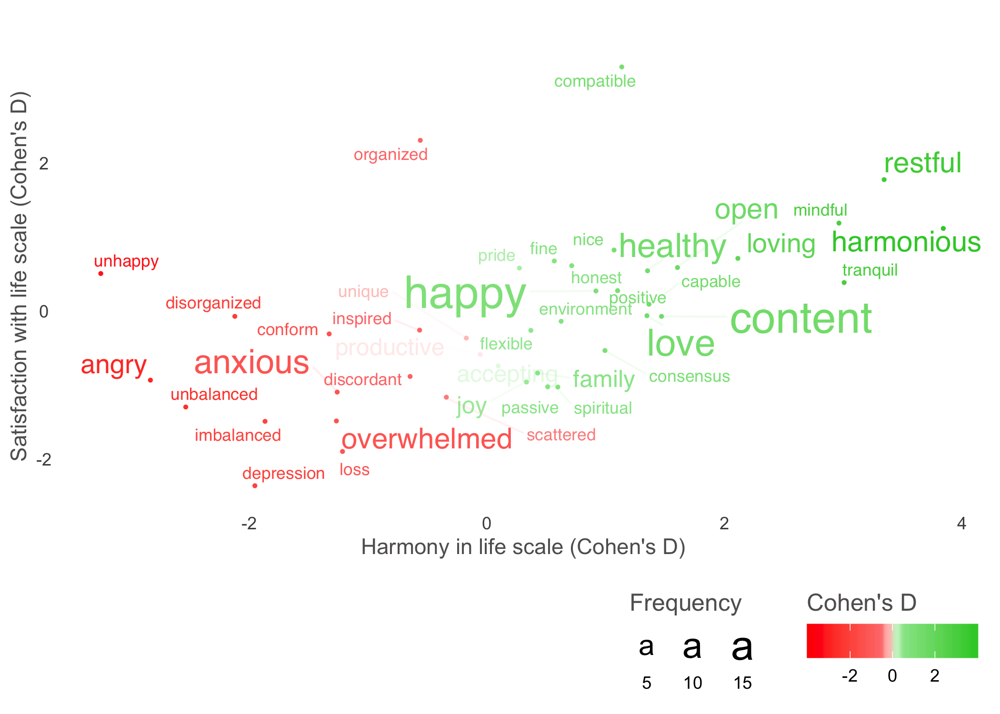

<!-- README.md is generated from README.Rmd. Please edit that file -->

# text

<!-- badges: start -->

<!-- badges: end -->

The `text`-package uses natural language processing and machine learning
methods to help you examine text variables, and their relation to
numerical variables.

## Installation

<!--You can install the released version of text from [CRAN](https://CRAN.R-project.org) with:

``` r
install.packages("text")
```-->

The default method to map words to numbers in `text` uses BERT. BERT is
a general-purpose language model that creates state-of-the-art word
embeddings based on deep learning. To achieve this, `text` relies on
`RBERT`, which in turn is based on TensorFlow; so make sure that these
packages are properly installed and working\! For up-to-date
instructions see [RBERT](https://github.com/johnERgordon/RBERT).

When above packages are installed and working, you can install the
development version `text` from [GitHub](https://github.com/), by first
installing devtools and then the command bellow.

``` r
# install.packages("devtools")
devtools::install_github("oscarkjell/text")
```

## Map your text to numbers

You can easily transform text variables to BERT word embeddings:

``` r
library(text)
# Get example data including both text and numerical variables
sq_data <- sq_data_tutorial8_10

# Transform the text data to BERT word embeddings
wordembeddings <- textImport(sq_data)
```

## Examine how your text relate to numerical variables

``` r
library(text)

# Load already imported word embeddings, and their corresponding numeric variables
wordembeddings <- wordembeddings4_10
numeric_data   <- sq_data_tutorial4_10


# Examine the relationship between harmony-text and Harmony in life scale (HILS) scores
model_htext_hils <- textTrain(wordembeddings$harmonytexts, numeric_data$hilstotal, nrFolds_k=2)

# Show the correlation between predicted and observed Harmony in life scale scores
model_htext_hils$Correlation
#> 
#>  Pearson's product-moment correlation
#> 
#> data:  model$pred$pred and model$pred$obs
#> t = 0.067528, df = 8, p-value = 0.9478
#> alternative hypothesis: true correlation is not equal to 0
#> 95 percent confidence interval:
#>  -0.6150004  0.6438191
#> sample estimates:
#>        cor 
#> 0.02386808
```

## Show your data by plotting statistically significant words

``` r
library(text)

# Example data that have been pre-processed with textPlotData function

plot <- textPlotViz(word_data = sq_data_plottingHw_HILSSSWLS_100,
      x_axes = "cohensD.x",
      y_axes = "cohensD.y",
      x_axes_label = "HILS: Cohen's D",
      y_axes_label = "SWLS: Cohen's D")
plot
```



<!--


In that case, don't forget to commit and push the resulting figure files, so they display on GitHub!-->
