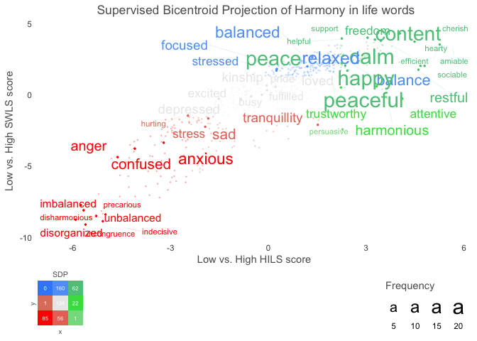

<!-- README.md is generated from README.Rmd. Please edit that file -->

# text 

<!-- badges: start -->

[](https://CRAN.R-project.org/package=text)
[](https://github.com/oscarkjell/text/actions)
[](https://www.repostatus.org/#active)
[](https://lifecycle.r-lib.org/articles/stages.html#maturing-1)
[](https://CRAN.R-project.org/package=text)
[](https://app.codecov.io/gh/oscarkjell/text)

<!-- badges: end -->

An R-package for analyzing text using Transformers from HuggingFace
using Natural Language Processing and Machine Learning.

The language that individuals use contains a wealth of psychological
information interesting for research. The *text*-package has two main
objectives:

-   First, to serve R-users as a *point solution* for transforming text
    to state-of-the-art word embeddings that are ready to be used for
    downstream tasks. The package provides a user-friendly link to
    language models based on transformers from [Hugging
    Face](https://huggingface.co/).

-   Second, to serve as an *end-to-end solution* that provides
    state-of-the-art AI techniques tailored for social and behavioral
    scientists.

<figure>

<figcaption aria-hidden="true">Modular and End-to-End
Solution</figcaption>
</figure>

*Text* is created through a collaboration between psychology and
computer science to address research needs and ensure state-of-the-art
techniques. It provides powerful functions tailored to test research
hypotheses in social and behavior sciences for both relatively small and
large datasets. *Text* is continuously tested on Ubuntu, Mac OS and
Windows using the latest stable R version.

[Tutorial paper](https://psyarxiv.com/293kt/)

### Short installation guide

Most users simply need to run below installation code. For those
experiencing problems or want more alternatives, please see the
[Extended Installation
Guide](https://www.r-text.org/articles/Extended%20Installation%20Guide.html).

For the text-package to work, you first have to install the text-package
in R, and then make it work with text required python packages.

1.  Install text-version (at the moment the second step only works using
    the development version of text from GitHub).

[GitHub](https://github.com/) development version:

``` r
# install.packages("devtools")
devtools::install_github("oscarkjell/text")
```

[CRAN](https://CRAN.R-project.org/package=text) version:

``` r
install.packages("text")
```

2.  Install and initialize text required python packages:

``` r
library(text)

# Install text required python packages in a conda environment (with defaults).
textrpp_install()

# Initialize the installed conda environment.
# save_profile = TRUE saves the settings so that you don't have to run textrpp_initialize() after restarting R. 
textrpp_initialize(save_profile = TRUE)
```

### Point solution for transforming text to embeddings

Recent significant advances in NLP research have resulted in improved
representations of human language (i.e., language models). These
language models have produced big performance gains in tasks related to
understanding human language. Text are making these SOTA models easily
accessible through an interface to
[HuggingFace](https://huggingface.co/docs/transformers/index) in Python.

``` r
library(text)
# Transform the text data to BERT word embeddings
wordembeddings <- textEmbed(Language_based_assessment_data_8, 
                            model = 'bert-base-uncased')
```

*Text* provides many of the contemporary state-of-the-art language
models that are based on deep learning to model word order and context.
Multilingual language models can also represent several languages;
multilingual BERT comprises *104 different languages*.

*Table 1. Some of the available language models*

| Models                         | References                                               | Layers | Dimensions | Language                                                                             |
|:-------------------------------|:---------------------------------------------------------|:-------|:-----------|:-------------------------------------------------------------------------------------|
| ‘bert-base-uncased’            | [Devlin et al. 2019](https://aclanthology.org/N19-1423/) | 12     | 768        | English                                                                              |
| ‘roberta-base’                 | [Liu et al. 2019](https://arxiv.org/abs/1907.11692)      | 12     | 768        | English                                                                              |
| ‘distilbert-base-cased’        | [Sahn et al., 2019](https://arxiv.org/abs/1910.01108)    | 6      | 768        | English                                                                              |
| ‘bert-base-multilingual-cased’ | [Devlin et al. 2019](https://aclanthology.org/N19-1423/) | 12     | 768        | [104 top languages at Wikipedia](https://meta.wikimedia.org/wiki/List_of_Wikipedias) |
| ‘xlm-roberta-large’            | [Liu et al](https://arxiv.org/pdf/1907.11692.pdf)        | 24     | 1024       | [100 language](https://huggingface.co/docs/transformers/multilingual)                |

See [HuggingFace](https://huggingface.co/models/) for a more
comprehensive list of models.

### An end-to-end package

*Text* also provides functions to analyse the word embeddings with
well-tested machine learning algorithms and statistics. The focus is to
analyze and visualize text, and their relation to other text or
numerical variables. An example is functions plotting statistically
significant words in the word embedding space.

``` r
library(text) 
# Use data (DP_projections_HILS_SWLS_100) that have been pre-processed with the textProjectionData function; the preprocessed test-data included in the package is called: DP_projections_HILS_SWLS_100
plot_projection <- textProjectionPlot(
  word_data = DP_projections_HILS_SWLS_100,
  y_axes = TRUE,
  title_top = " Supervised Bicentroid Projection of Harmony in life words",
  x_axes_label = "Low vs. High HILS score",
  y_axes_label = "Low vs. High SWLS score",
  position_jitter_hight = 0.5,
  position_jitter_width = 0.8
)
plot_projection
#> $final_plot
```



    #> 
    #> $description
    #> [1] "INFORMATION ABOUT THE PROJECTION type = textProjection words = $ wordembeddings = Information about the embeddings. textEmbedLayersOutput:  model: bert-base-uncased ;  layers: 11 12 . Warnings from python:  Some weights of the model checkpoint at bert-base-uncased were not used when initializing BertModel: ['cls.seq_relationship.bias', 'cls.seq_relationship.weight', 'cls.predictions.transform.LayerNorm.bias', 'cls.predictions.transform.dense.bias', 'cls.predictions.decoder.weight', 'cls.predictions.bias', 'cls.predictions.transform.LayerNorm.weight', 'cls.predictions.transform.dense.weight']\n- This IS expected if you are initializing BertModel from the checkpoint of a model trained on another task or with another architecture (e.g. initializing a BertForSequenceClassification model from a BertForPreTraining model).\n- This IS NOT expected if you are initializing BertModel from the checkpoint of a model that you expect to be exactly identical (initializing a BertForSequenceClassification model from a BertForSequenceClassification model).\n\n textEmbedLayerAggregation: layers =  11 12 aggregate_layers =  concatenate aggregate_tokens =  mean tokens_select =   tokens_deselect =   single_wordembeddings = Information about the embeddings. textEmbedLayersOutput:  model: bert-base-uncased layers: 11 12 . textEmbedLayerAggregation: layers =  11 12 aggregate_layers =  concatenate aggregate_tokens =  mean tokens_select =   tokens_deselect =   x = $ y = $ pca =  aggregation =  mean split =  quartile word_weight_power = 1 min_freq_words_test = 0 Npermutations = 1e+06 n_per_split = 1e+05 type = textProjection words = Language_based_assessment_data_3_100 wordembeddings = Information about the embeddings. textEmbedLayersOutput:  model: bert-base-uncased ;  layers: 11 12 . Warnings from python:  Some weights of the model checkpoint at bert-base-uncased were not used when initializing BertModel: ['cls.seq_relationship.bias', 'cls.seq_relationship.weight', 'cls.predictions.transform.LayerNorm.bias', 'cls.predictions.transform.dense.bias', 'cls.predictions.decoder.weight', 'cls.predictions.bias', 'cls.predictions.transform.LayerNorm.weight', 'cls.predictions.transform.dense.weight']\n- This IS expected if you are initializing BertModel from the checkpoint of a model trained on another task or with another architecture (e.g. initializing a BertForSequenceClassification model from a BertForPreTraining model).\n- This IS NOT expected if you are initializing BertModel from the checkpoint of a model that you expect to be exactly identical (initializing a BertForSequenceClassification model from a BertForSequenceClassification model).\n\n textEmbedLayerAggregation: layers =  11 12 aggregate_layers =  concatenate aggregate_tokens =  mean tokens_select =   tokens_deselect =   single_wordembeddings = Information about the embeddings. textEmbedLayersOutput:  model: bert-base-uncased layers: 11 12 . textEmbedLayerAggregation: layers =  11 12 aggregate_layers =  concatenate aggregate_tokens =  mean tokens_select =   tokens_deselect =   x = Language_based_assessment_data_3_100 y = Language_based_assessment_data_3_100 pca =  aggregation =  mean split =  quartile word_weight_power = 1 min_freq_words_test = 0 Npermutations = 1e+06 n_per_split = 1e+05 type = textProjection words = harmonywords wordembeddings = Information about the embeddings. textEmbedLayersOutput:  model: bert-base-uncased ;  layers: 11 12 . Warnings from python:  Some weights of the model checkpoint at bert-base-uncased were not used when initializing BertModel: ['cls.seq_relationship.bias', 'cls.seq_relationship.weight', 'cls.predictions.transform.LayerNorm.bias', 'cls.predictions.transform.dense.bias', 'cls.predictions.decoder.weight', 'cls.predictions.bias', 'cls.predictions.transform.LayerNorm.weight', 'cls.predictions.transform.dense.weight']\n- This IS expected if you are initializing BertModel from the checkpoint of a model trained on another task or with another architecture (e.g. initializing a BertForSequenceClassification model from a BertForPreTraining model).\n- This IS NOT expected if you are initializing BertModel from the checkpoint of a model that you expect to be exactly identical (initializing a BertForSequenceClassification model from a BertForSequenceClassification model).\n\n textEmbedLayerAggregation: layers =  11 12 aggregate_layers =  concatenate aggregate_tokens =  mean tokens_select =   tokens_deselect =   single_wordembeddings = Information about the embeddings. textEmbedLayersOutput:  model: bert-base-uncased layers: 11 12 . textEmbedLayerAggregation: layers =  11 12 aggregate_layers =  concatenate aggregate_tokens =  mean tokens_select =   tokens_deselect =   x = hilstotal y = swlstotal pca =  aggregation =  mean split =  quartile word_weight_power = 1 min_freq_words_test = 0 Npermutations = 1e+06 n_per_split = 1e+05 INFORMATION ABOUT THE PLOT word_data = word_data k_n_words_to_test = FALSE min_freq_words_test = 1 min_freq_words_plot = 1 plot_n_words_square = 3 plot_n_words_p = 5 plot_n_word_extreme = 5 plot_n_word_frequency = 5 plot_n_words_middle = 5 y_axes = TRUE p_alpha = 0.05 p_adjust_method = none bivariate_color_codes = #398CF9 #60A1F7 #5dc688 #e07f6a #EAEAEA #40DD52 #FF0000 #EA7467 #85DB8E word_size_range = 3 - 8 position_jitter_hight = 0.5 position_jitter_width = 0.8 point_size = 0.5 arrow_transparency = 0.5 points_without_words_size = 0.2 points_without_words_alpha = 0.2 legend_x_position = 0.02 legend_y_position = 0.02 legend_h_size = 0.2 legend_w_size = 0.2 legend_title_size = 7 legend_number_size = 2"
    #> 
    #> $processed_word_data
    #> # A tibble: 583 × 32
    #>    words   x_plotted p_values_x n_g1.x n_g2.x y_plotted p_values_y n_g1.y n_g2.y
    #>    <chr>       <dbl>      <dbl>  <dbl>  <dbl>     <dbl>      <dbl>  <dbl>  <dbl>
    #>  1 able        1.42      0.194       0      1     2.99  0.0000181       0      0
    #>  2 accept…     0.732     0.451      -1      1     1.40  0.0396         -1      1
    #>  3 accord      2.04      0.0651      0      1     3.45  0.00000401      0      1
    #>  4 active      1.46      0.180       0      1     1.92  0.00895         0      1
    #>  5 adapta…     2.40      0.0311      0      0     0.960 0.113           0      0
    #>  6 admiri…     0.161     0.839       0      0     1.58  0.0255          0      0
    #>  7 adrift     -2.64      0.0245     -1      0    -3.17  0.0000422      -1      0
    #>  8 affini…     1.03      0.320       0      1     2.24  0.00324         0      1
    #>  9 agreei…     1.62      0.140       0      1     2.12  0.00500         0      0
    #> 10 alcohol    -2.15      0.0822     -1      0    -1.78  0.0212          0      0
    #> # … with 573 more rows, and 23 more variables: n <dbl>, n.percent <dbl>,
    #> #   N_participant_responses <int>, adjusted_p_values.x <dbl>,
    #> #   adjusted_p_values.y <dbl>, square_categories <dbl>, check_p_square <dbl>,
    #> #   check_p_x_neg <dbl>, check_p_x_pos <dbl>, check_extreme_max_x <dbl>,
    #> #   check_extreme_min_x <dbl>, check_extreme_frequency_x <dbl>,
    #> #   check_middle_x <dbl>, extremes_all_x <dbl>, check_p_y_pos <dbl>,
    #> #   check_p_y_neg <dbl>, check_extreme_max_y <dbl>, …
