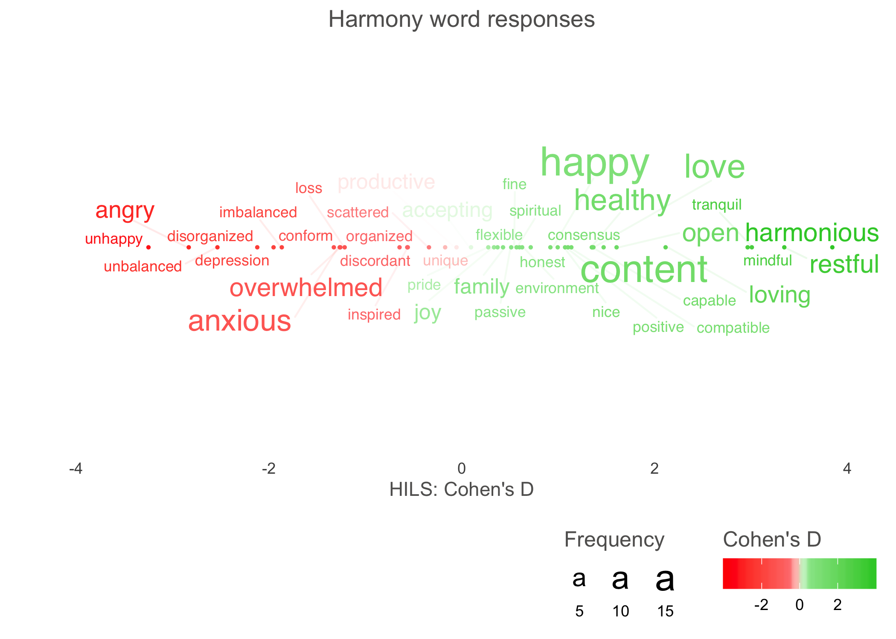
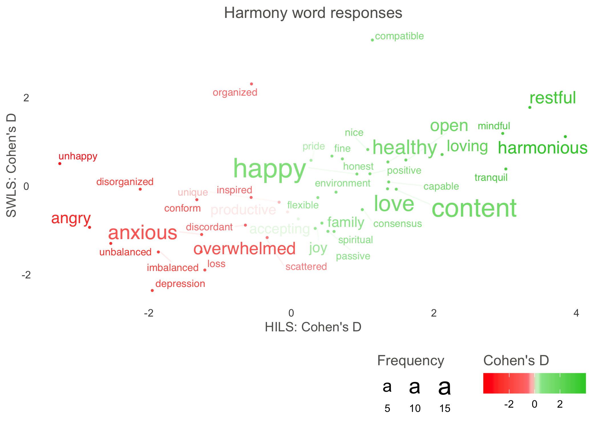

Introduction to `text`
================

The `text`-package uses natural language processing and machine learning
methods to examine text and numerical variables.

The default method in `text` to map words to numbers uses
[BERT](https://ai.googleblog.com/2018/11/open-sourcing-bert-state-of-art-pre.html),
is a general-purpose language model that creates state-of-the-art word
embeddings based on deep learning. To achieve this, `text` relies on
`RBERT`, which in turn is based on TensorFlow; so make sure that this
packages are properly installed and working (see
[RBERT](https://github.com/johnERgordon/RBERT).

Important `text` functions are described below. The data and methods
come from the [Semantic Measures
Methods](https://www.ncbi.nlm.nih.gov/pubmed/29963879)
([Pre-print](https://psyarxiv.com/er6t7/)), which demonstrates how
individuals’ open-ended text answers can be used to *measure*,
*describe* and *differentiate* psychological constructs.

In short the workflow includes to first transform text variables into
word embeddings. These word embeddings are then used in different ways
to, for example, predict numerical variables, compute semantic
similarity scores between texts, or statistically test difference in
meaning between two sets of texts.

# Getting started with `text`

## `textImport()`: mapping text to numbers (i.e., word embeddings)

The example data that will be used in this tutorial comes from
participants that have described their harmony in life and satisfaction
with life with a text response, 10 descriptive words or rating scales.
The `textImport()` function will automatically transform character
variables in a given tibble to word embeddings.

``` r

library(text)

# Get example data including both text and numerical variables
sq_data <- sq_data_tutorial8_10

# Transform the text data to BERT word embeddings
wordembeddings <- textImport(sq_data)

# See how word embeddings are structured
wordembeddings

# Save the word embeddings to avoid having to import the text everytime
saveRDS(wordembeddings.rds)

# Get the word embeddings again  
wordembeddings <- readRDS(wordembeddings.rds)
```

## `textTrain()`: Examine the relationship between text and numeric variables

The `textTrain()` is used to examine how well the word embeddings from a
text can predict a numeric variable. This is done by training the word
embeddings using ridge regression and 10-fold cross-validation (where
the word embeddings are pre-processed using pca). In the example below
we examine how well the harmony text responses can pred rating scale
socres from the Harmony in life scale.

``` r
library(text)

# Load already imported word embeddings
# (above we only imported 10 rows/participants; whereas below we load 100 rows/participants
wordembeddings <- wordembeddings4_10
# Load corresponding numeric variables
numeric_data <- sq_data_tutorial8_10

# Examine the relationship between harmonytext and the correspondnig rating scale
model_htext_hils <- textTrain(wordembeddings$harmonytexts, numeric_data$hilstotal, nrFolds_k=2)

#Examine the correlation between predicted and observed Harmony in life scale scores
model_htext_hils$Correlation
#> 
#>  Pearson's product-moment correlation
#> 
#> data:  model$pred$pred and model$pred$obs
#> t = -0.43906, df = 8, p-value = 0.6722
#> alternative hypothesis: true correlation is not equal to 0
#> 95 percent confidence interval:
#>  -0.7140553  0.5271456
#> sample estimates:
#>        cor 
#> -0.1533924


# Using textTrainLists enables you to quickly run through several lists of wordembeddings 
#predicting several outcomes 
wordembeddings <- wordembeddings4_10[1:2]
ratings_data <- sq_data_tutorial8_10[5:6]
outcomes <- textTrainLists(wordembeddings, ratings_data, nrFolds_k=2)
#> c("hilstotal", "swlstotal")
outcomes
#>                     descriptions             p_value         correlation
#> 1      harmonywords -> hilstotal   0.200518441393533   0.442340110470891
#> 2 satisfactionwords -> hilstotal   0.935470404877659 -0.0295249676400909
#> 3      harmonywords -> swlstotal   0.470072548683398  -0.258924161254016
#> 4 satisfactionwords -> swlstotal 0.00026649942428823   0.909173159105644
```

## `predict()` features of text based on trained models from `textTrain`

Trained models (for example the one we did in the example above) can be
applied to new datasets. Below we will apply a model that has been
trained to predict valence.

``` r
library(text)
library(psych)

# Load already imported word embeddings
wordembeddings <- wordembeddings4_10
# Load corresponding numeric variables
numeric_data <- sq_data_tutorial8_10

# Get a valence trained prediction model that has been created from another dataset. 
valence_prediction_model <- readRDS(
  url("https://oscarkjell.se/text_models/trained_anew1999_valence.rda"))

# Apply the valence model to the harmony text
numeric_data$htext_valence <- predict(valence_prediction_model$Model, wordembeddings$harmonytexts)

# Examine the correlation between the predicted valence and the Harmony in life scale score
corr.test(numeric_data$htext_valence, numeric_data$hilstotal)
```

## `textSimilarity()`: Compute semantic similiarty scales

The `textSimilarity()` function measures the semantic similairty between
to column of texts, and the `textSimilarityNorm()` measures the semantic
similairty between texts in a column and word norm. Semantic similarity
scores can be used to measure psychological construct independent from
rating scales by using word norms that represent the to-be-measured
construct. The word norms have been created by asking participants to
describe a psychological constructs. The word norm can be used to
measure the semantic similiarty between a person’s answer whether they
experience harmony in their life to the word norm describing harmony in
life: If the score is high the person is seen to have high harmony in
life.

``` r

library(text)
library(psych)

# Load already imported word embeddings
wordembeddings <- wordembeddings4_10
# Load corresponding numeric variables
numeric_data <- sq_data_tutorial8_10

# Compute semantic similiarty scores between two text columns
semantic_similarity_scores <- textSimilarity(wordembeddings$harmonytexts, 
                                             wordembeddings$satisfactiontexts)
# Lood at the first scores
head(semantic_similarity_scores)
#> [1] 0.9425611 0.8995338 0.8906565 0.9299760 0.9299886 0.8922852

# Get word embeddings for word norms from a free online library
word_norms_embeddings <- readRDS(
  url("https://oscarkjell.se/text_models/semsim_Word_Norms_Mental_Health_Kjell2018.rda"))

# Examine which word norms there are
names(word_norms_embeddings)
#> [1] "harmonynorm"           "satisfactionnorm"      "disharmonynorm"       
#> [4] "dissatisfactionnorm"   "worriednorm"           "depressednorm"        
#> [7] "notatalldepressednorm" "notatallworriednorm"   "descrition_of_norms"

# See information about the norms
word_norms_embeddings$descrition_of_norms
#> [1] "These norms are based on word norms collected in Kjell et al., 2018. First, we removed the added words in Kjell et al.; then we randomly selected 512 words (since this is what the BERT model can take) in each norm; finally we added the target word of each norm so that it is the most frequent word by 1. See Kjell, O. N., Kjell, K., Garcia, D., & Sikström, S. (2019). Semantic measures: Using natural language processing to measure, differentiate, and describe psychological constructs. Psychological methods, 24(1), 92."

# Compute semantic similiarty score between the harmony answers and the harmony norm
# Note that the descriptive word answers are used instead of text answers to correspond with 
#how the word norm was created.
norm_similarity_scores_harmony <- textSimilarityNorm(wordembeddings$harmonywords, 
                                                     word_norms_embeddings$harmonynorm)

# Correlating the semantic measure with the corresponding rating scale
corr.test(norm_similarity_scores_harmony, numeric_data$hilstotal)
#> Call:corr.test(x = norm_similarity_scores_harmony, y = numeric_data$hilstotal)
#> Correlation matrix 
#> [1] 0.09
#> Sample Size 
#> [1] 10
#> Probability values  adjusted for multiple tests. 
#> [1] 0.81
#> 
#>  To see confidence intervals of the correlations, print with the short=FALSE option
```

## `textTtest()`: Test the difference in meaning between to sets of texts

The `textTtest()` function provide a test to examine whether two set of
texts significantly differ in meaning. It produces a t-value, p-value
and cohen’s D effect size. Below we examine whether the harmont text and
saitsfaction text responses differ in meaning.

``` r

library(text)

# Load word embeddings
wordembeddings <- wordembeddings4_10

# Compare the meaning between individuals' harmony in life and satisfaction with life answers
textTtest(wordembeddings$harmonytexts, wordembeddings$satisfactiontexts)
#> [[1]]
#> Call: cohen.d(x = xy, group = "group", alpha = 0.05, std = TRUE)
#> Cohen d statistic of difference between two means
#>   lower effect upper
#> x  -3.7   -2.4 -0.96
#> 
#> Multivariate (Mahalanobis) distance between groups
#> [1] 2.4
#> r equivalent of difference between two means
#>     x 
#> -0.77 
#> 
#> [[2]]
#> 
#>  Welch Two Sample t-test
#> 
#> data:  x and y
#> t = 5.0452, df = 17.937, p-value = 8.506e-05
#> alternative hypothesis: true difference in means is not equal to 0
#> 95 percent confidence interval:
#>  0.04651136 0.11291668
#> sample estimates:
#>   mean of x   mean of y 
#>  0.03691665 -0.04279737

# Note that if you want to get the scores used in the t-test use:
semantic_difference_scores <- textTtestscores(wordembeddings$harmonytexts, 
                                              wordembeddings$satisfactiontexts, 
                                              nrFolds=2)
```

## Plot statistically significant words

The plotting is made in two steps: First the `textPlotData()` function
is pre-procssing the data, including computing statistics for each word
to be plotted. Second, `textPlotViz()` is plotting the words, including
many options to set color, font etc for the figure. Dividing this
procedure into two steps makes the process more transparent (since the
user naturally get to see the output that the words are plotted
according to) and quicker since the more heavy computations are made the
last step goes quicker so that one can tr different visual settings.

### Pre-process word data with `textPlotData()`

``` r
library(text)

# Pre-process word data to be plotted with textPlotViz-function

# Get example data within package
wordembeddings <- wordembeddings4_10
data <- sq_data_tutorial8_10

# Pre-process data
df_for_plotting <- textPlotData(data$harmonywords, wordembeddings$harmonywords,
wordembeddings$singlewords_we,
data$hilstotal, data$swlstotal,
Bonferroni = TRUE, nrFolds=2, Ndim=768)
df_for_plotting
#> # A tibble: 5 x 13
#>   words mean.x   n.x   sd.x p_values.x t_statistic.x cohensD.x  mean.y   n.y
#>   <chr>  <dbl> <dbl>  <dbl>      <dbl>         <dbl>     <dbl>   <dbl> <dbl>
#> 1 anxi… -0.901     2 0.0479   7.75e- 1        -0.367    -0.291  0.126      2
#> 2 grow… -0.885     2 0.0233   8.68e- 1         0.206     0.112  0.123      2
#> 3 loved -0.911     2 0        1.14e- 8        -6.22     -0.871  0.0282     2
#> 4 peace -0.904     2 0.0350   6.43e- 1        -0.621    -0.430 -0.0567     2
#> 5 peac… -0.924     2 0        8.31e-16        -9.56     -1.34   0.0151     2
#> # … with 4 more variables: sd.y <dbl>, p_values.y <dbl>, t_statistic.y <dbl>,
#> #   cohensD.y <dbl>
```

### `textPlotViz()`: A One-dimensional word plot

``` r
library(text)

# Example data that have been pre-processed with textPlotData function

plot <- textPlotViz(word_data = sq_data_plottingHw_HILSSSWLS_100,
                    title_top = "Harmony word responses",
                    x_axes = "cohensD.x",
                    y_axes = NULL, 
                    x_axes_label = "HILS: Cohen's D",
                    y_axes_label = " ",
                    scale_x_axes_lim = c(-4,4),
                    y_axes_values = element_blank())
plot
```

<!-- -->

### `textPlotViz()`: A Two-dimensional word plot

``` r
library(text)

# Example data that have been pre-processed with textPlotData function

plot <- textPlotViz(word_data = sq_data_plottingHw_HILSSSWLS_100,
                    title_top = "Harmony word responses",
                    x_axes = "cohensD.x",
                    y_axes = "cohensD.y",
                    x_axes_label = "HILS: Cohen's D",
                    y_axes_label = "SWLS: Cohen's D")
plot
```

<!-- -->
